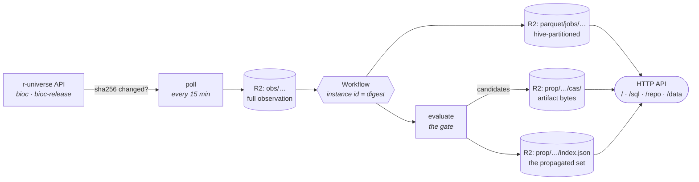
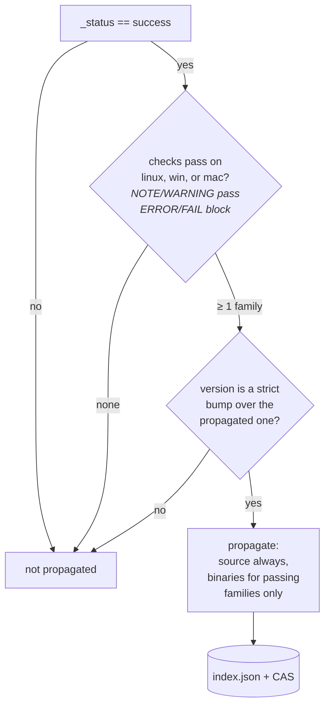

# bioc-registry

[](LICENSE)
[](https://bioc-registry.seandavi.workers.dev/docs)
[](CODE_OF_CONDUCT.md)

**The Bioconductor package registry** — package metadata, propagated versions,
installable artifacts, provenance, and build/check state, behind one HTTP API.

- 🌐 **Live:** <https://bioc-registry.seandavi.workers.dev>
- 📖 **API reference:** [`docs/api.md`](docs/api.md) · try it at [`/docs`](https://bioc-registry.seandavi.workers.dev/docs)
- 🔎 **Ad-hoc SQL over the archive:** [`/sql`](https://bioc-registry.seandavi.workers.dev/sql)

It watches the Bioconductor → r-universe build system, keeps every observation
forever, decides which packages are fit to publish, and serves the result three
ways: as a website, as an installable R repository, and as a Parquet archive you
can query directly from DuckDB.

## Try it in 30 seconds

```r
# install from the repo (devel; use /repo/bioc-release for release)
install.packages("edgeR", repos = "https://bioc-registry.seandavi.workers.dev/repo/bioc")
```

```bash
# what propagated, and from which commit
curl -s https://bioc-registry.seandavi.workers.dev/data/prop/bioc/index.json | jq '.edgeR'
```

```python
# every check verdict, straight out of the parquet archive — no download step
import duckdb, requests
BASE = "https://bioc-registry.seandavi.workers.dev"
# HTTP has no directory listing, so the file list comes from /manifest.json
files = ", ".join(f"'{BASE}/data/{k}'"
                  for k in requests.get(f"{BASE}/manifest.json").json()
                  if "universe=bioc/" in k)
duckdb.sql(f"""
  SELECT config, "check", count(*) AS n
  FROM read_parquet([{files}], union_by_name = true)
  GROUP BY ALL ORDER BY n DESC
""")
```

## How it works

A cron poll turns "upstream changed" into exactly one workflow run per distinct
upstream state, and everything downstream of that is idempotent.



Only the digest of the response body decides whether anything happens: an
unchanged upstream is a no-op, and a repeated observation reuses the same
workflow instance id, so reacting twice is impossible.

### The gate

A package propagates when it built **and** its checks pass on at least one
architecture — the same shape of rule the legacy BBS applied, resolved against
the R version Bioconductor currently gates on (read from `config.yaml`, not
hardcoded, because it moves with the R release cycle).



BiocCheck and wasm are **advisory**: recorded on the index entry, never
blocking. The passing set is kept as `archs`, so a consumer can see exactly
which platforms a package earned.

### Two ways in

Not everything Bioconductor ships passes that gate. About 300 packages build in
Bioconductor's own build system and fail in r-universe's environment — usually
because an example reaches an external service the runner cannot get to. Those
are **seeded** from the official repositories so this registry matches what
Bioconductor actually publishes.

Every index entry therefore records an `origin`:

| origin | means |
|---|---|
| `r-universe` | passed the gate above; `archs` says which platforms |
| `bioconductor` | seeded from Bioconductor's own release build; never faced this gate, so `archs` is empty and `bioccheck` is null |

Seeding is strictly additive — it only fills holes, and the version gate is
untouched, so a seeded package is replaced the ordinary way: the maintainer bumps
the version and r-universe builds it. The dashboard counts the two apart, and
shows how many seeded entries the official repo has since moved past.

### What's stored

Everything is write-once except the `state/` pointers, and everything is
readable through `/data/<key>`:

| prefix | what |
|---|---|
| `obs/{universe}/dt=…` | full observations, forever — the raw record |
| `parquet/jobs/…` | jobs table, stored as **changes not snapshots** (~99.9% of consecutive rows are identical) |
| `prop/{universe}/index.json` | what the repo serves: version, sha256, artifacts, DESCRIPTION, metadata, source repo, and `origin` |
| `prop/{universe}/cas/{sha256}` | artifact bytes, content-addressed |
| `logs/{universe}/{job}.txt` | captured GHA logs, readable after GitHub expires them at ~90 days |

Full key reference, parquet schema, and index shape: [`docs/api.md`](docs/api.md).

## Routes

| route | what |
|---|---|
| `/` | dashboard — per-universe tiles, config × check-status table |
| `/pkg/{universe}/{package}` | package page: jobs, propagation entry, full history via DuckDB-WASM |
| `/repo/{universe}/…` | installable CRAN-layout repo (`PACKAGES`, `VIEWS`, artifacts) |
| `/data/<r2-key>` | any object, with Range + CORS (remote DuckDB works) |
| `/logs/{universe}/{job}` | captured build log |
| `/sql` | in-browser SQL console over the whole archive |
| `/docs`, `/openapi.json` | API reference with a try-it panel |
| `/manifest.json` | list of parquet keys |

`/poll`, `/backfill`, `/reindex` are side-effecting maintenance routes, gated on
a shared secret and deliberately absent from the OpenAPI spec.

## Scope

This is *a* producer in the Bioconductor data plane — the
build/propagation/metadata one — not the whole plane. Other producers (download
statistics, site snapshots) publish under the same contract from their own
homes; see [`docs/DATAPLANE.md`](docs/DATAPLANE.md).

Design notes and measurements from the original experiment are in
[`docs/findings.md`](docs/findings.md).

## Development

```bash
npm install
npm test        # node --test, no framework
npm run dev     # local worker at :8787 — hit /poll once to fill the bucket
```

Stack: TypeScript on Cloudflare Workers + Workflows + R2, `hyparquet` for
parquet, DuckDB-WASM in the browser. No server, no database, no framework.

See [CONTRIBUTING.md](CONTRIBUTING.md) — note that **a route change is not
finished until `docs/api.md` and `src/openapi.ts` are updated too**.

## Ops

```bash
CLOUDFLARE_API_TOKEN=… CLOUDFLARE_ACCOUNT_ID=… npx wrangler deploy
npx wrangler workflows instances list bioc-prop-observe
curl -H "x-maint-key: …" https://bioc-registry.seandavi.workers.dev/poll
```

Credentials live in Google Secret Manager (project `cdsci-infra`):

| GSM secret | used as | what breaks without it |
|---|---|---|
| `cdsci-cloudflare-workers-token` | `CLOUDFLARE_API_TOKEN` | `wrangler deploy` |
| `cdsci-r2-account-id` | `CLOUDFLARE_ACCOUNT_ID` | `wrangler deploy` |
| `cdsci-github-actions-read-token` | `GITHUB_TOKEN` worker secret | **log capture silently no-ops** — GitHub 403s unauthenticated log downloads |
| `cdsci-bioc-registry-maint-key` | `MAINT_KEY` worker secret | `/poll`, `/backfill`, `/reindex` become open to the world |

The two worker secrets are set once per environment and are not in this repo:

```bash
# tr -d is not optional: gcloud emits a trailing newline, wrangler stores it
# verbatim, and a token with a newline makes every GitHub request throw
# "Invalid header value" — silently, since capture swallows its own errors.
gcloud secrets versions access latest \
  --secret=cdsci-github-actions-read-token --project=cdsci-infra |
  tr -d '\r\n' | npx wrangler secret put GITHUB_TOKEN
npx wrangler secret list        # confirm both are present
```

Log capture is best-effort and swallows its own errors, so the health check is
the cursor: `curl -s …/data/state/bioc/logcursor` must advance within a cron
tick or two. `wrangler tail` reports
spurious "code had hung" errors for workflow runs — check instance status
instead, they complete fine.

## Citing, licence, conduct

- Cite via [CITATION.cff](CITATION.cff) (GitHub's "Cite this repository")
- [Apache License 2.0](LICENSE)
- [Bioconductor Code of Conduct](CODE_OF_CONDUCT.md)
