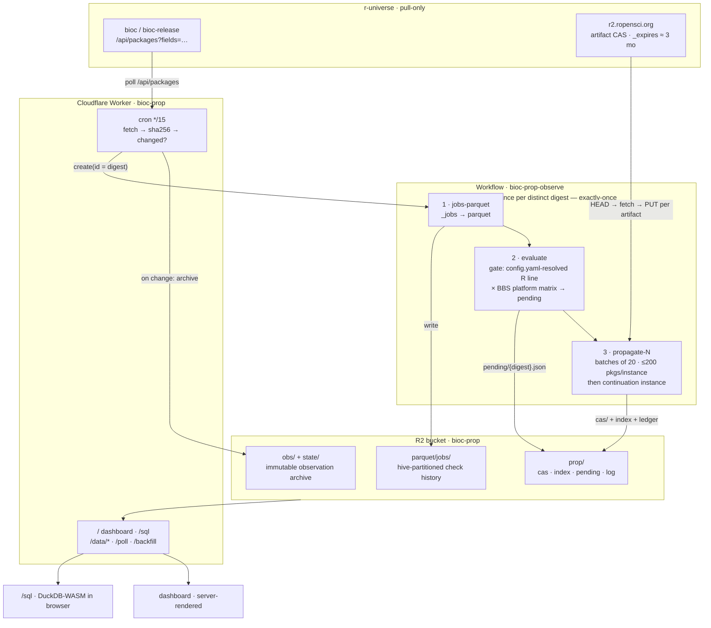

# Bioconductor × r-universe: build tracking & propagation experiment

*Findings and design notes — 2026-08-08. System live at
[bioc-prop.seandavi.workers.dev](https://bioc-prop.seandavi.workers.dev/)
([SQL console](https://bioc-prop.seandavi.workers.dev/sql) ·
[API documentation](api.md)).*

## What this is

An experiment in the propagation/history layer for Bioconductor's move to
r-universe (`bioc.r-universe.dev` = devel/3.24, `bioc-release.r-universe.dev` =
release/3.23). It polls the r-universe API, archives every observed state,
converts check results to a queryable Parquet catalog, and propagates gated
packages' artifacts into a content-addressed store — with the gate designed to
match what production BBS actually enforces.

## Key findings

### 1. BiocCheck has never been a production gate

The production build report (`checkResults/3.23/bioc-LATEST`) runs INSTALL →
BUILD → CHECK → BUILD BIN. **There is no BiocCheck stage on the main daily
builds.** BiocCheck is enforced exactly once in a package's life: at submission
review. Compliance is never re-checked, while the policy bar keeps rising — so
long-standing packages carry policy debt (edgeR was admitted ~2008; the
"Authors@R, not Maintainer" and "80% runnable examples" rules came later).

BBS *does* have a BiocCheck stage (`STAGE4B` in `BBS-run.py`), currently
enabled only on the experimental **bioc-rapid** builds — where it is explicitly
advisory. From `BBSreportutils.py`:

> "The results of the 'bioccheck' stage are not taken into consideration at the
> moment to determine package overall status or propagation, which is why the
> associated status glyphes have mild/hazy colors."

On bioc-rapid today, 172 of 236 packages (73%) are `MILDERROR` on bioccheck.
Our corpus-wide numbers agree: ~880 packages per universe fail *only*
BiocCheck — including edgeR, limma, DESeq2, clusterProfiler, at the exact
versions production ships. Dominant rules: `Maintainer` field vs `Authors@R`
(31/43 sampled) and the runnable-examples coverage rule (15/43).

**Conclusion adopted:** BiocCheck is advisory in our gate too. The verdict is
recorded per package in the propagation index — giving, incidentally, the
first continuously updated view of BiocCheck compliance across the corpus.

### 2. The BBS propagation criterion, precisely

From `BBS-make-OUTGOING.py`, a package propagates to the production repo when:

- `BUILD` = OK, and
- `CHECK` ∈ {OK, WARNINGS} (check ERROR **does** block), and
- `BUILD BIN` = OK where applicable

on the BBS platform matrix: the branch's R on **linux x86_64, windows x86_64,
mac arm64**. Notably (config.yaml `r_ver_for_bioc_ver`): **both 3.23 and 3.24
run R 4.6** — devel only jumps to a new R in the spring cycle. R-devel,
R-oldrel, linux arm64, mac x86_64, windows arm64 are not tested by BBS at all,
while r-universe checks all of them.

### 3. Failure taxonomy (both universes, ~1,400 gated under the strictest gate)

| class | release | devel | causes (from log sampling) |
|---|---|---|---|
| BiocCheck-only | 883 | 861 | policy debt: Maintainer field, examples coverage |
| platform check ERROR | ~270 real | ~258 | tests (27/40) and examples (26/40); heavily network-dependent (Ensembl/AnnotationHub timeouts) |
| wasm-only / infra FAIL (no verdict) | 131 | 120 | CI weather, not package code |
| build failure | 120 | 115 | 13/16 sampled = vignette build errors, again often network |

Release and devel fail almost identically (1,263 packages gated in both, 94%
same class) — it is one story, not two.

### 4. Production comparison

Of packages gated by the strict all-green gate, **94% are at the same version
production currently ships** — the strict gate would have withheld a repo
production considers fine. Cross-checking the still-gated set against the BBS
report: ~30% are red on BBS too (genuine breakage, agreement); of the
production-green remainder, roughly half fail only on platforms/R versions BBS
never tests, and half fail on BBS-covered configs (true environment
differences — likely GitHub-runner IP rate-limiting by Ensembl/NCBI, etc.).

### 5. One shot vs. retries — the structural divergence

With criteria now matched, the remaining driver of disagreement is **cadence**:

- **BBS** rebuilds *every* package *nightly*: ~30 propagation attempts per
  month. Transient flakes wash out. Once propagated, a tarball stays in the
  repo through later failures ("last good wins").
- **r-universe** builds *on change*: one commit → one build → one verdict,
  frozen into the API until the next commit. A network flake at the wrong
  moment blocks a new version for months.

Same gate + different retry budget = accumulating flake-blocks that BBS never
shows. Remedies, in order of leverage:

1. **Upstream retries** — r-universe supports build re-triggering (universe
   owners; programmatically a GHA re-run on `r-universe/bioc-*`). A scheduled
   "rebuild current failures weekly" job would restore the BBS retry property
   at a fraction of nightly-everything cost. Needs coordination with Jeroen.
2. **A needs-rebuild worklist** — we can already compute "gate-blocked
   candidates whose failing config passed for the previous version" (the
   one-retry-from-propagating set) and surface it on the dashboard for a human
   with the retry button. Zero permissions needed.
3. **Flake discrimination from history** — as observations accumulate, the
   Parquet time series distinguishes fails-consistently from failed-once.

### 6. API blind spots worth knowing

- **Failed rebuilds hide behind success.** When a newer commit fails, the main
  `/api/packages` record keeps showing the last successful build; the failure
  is visible only in the `_failure` field (11 packages in release today, e.g.
  TADCompare shows 1.22.0 while 1.22.1 sits failed). We now capture `_failure`
  in every observation.
- 17 packages have no successful build ever (no `_status` at all); 1 package
  (LRDE) is registered but entirely absent from the API. Registry-vs-API
  diffing would catch that class.
- Artifacts on `r2.ropensci.org` carry `_expires` ≈ 3 months. Healthy packages
  refresh constantly; **stuck-failing packages are exactly the ones whose
  last-good artifacts age out** — the archival motivation below.
- GHA check-log artifacts require authentication and expire; ~8% of sampled
  jobs had no artifact uploaded at all. Log capture has a real deadline.

## The current gate

A package version propagates when **all** of:

1. `_status == "success"` (the build produced artifacts)
2. Among **gating jobs** — jobs whose R version matches the branch's R minor
   (resolved at evaluate time from `config.yaml` `r_ver_for_bioc_ver`, so the
   mapping follows the R release cycle automatically) on the BBS platform
   matrix (source, linux x86_64, windows x86_64, mac arm64) — **no ERROR, FAIL,
   or FAILURE**. NOTE and WARNING pass, matching `BBS-make-OUTGOING.py`.
3. Version parses as a valid R version and is a **strict bump** over the last
   propagated version (release and devel tracked independently).

**Advisory, recorded but never blocking:** BiocCheck (`bioc-checks`), wasm,
R-devel and R-oldrel checks, linux arm64, mac x86_64, windows arm64. The
BiocCheck verdict is stored in the index per package.

Coverage under this gate: **2,077 / 2,417 (release), 2,089 / 2,414 (devel)** —
versus 1,013/1,060 under the initial all-green-everything gate. The ~340
residual per universe: ~140 that production also shows red, plus the
environment/one-shot cases in §5.

## What and how we store

Everything lives in one Cloudflare R2 bucket (`bioc-prop`), all writes
idempotent and content-addressed where possible:

| prefix | content | properties |
|---|---|---|
| `obs/{universe}/dt=…/{ts}-{digest}.json` | full observation body (build-relevant fields incl. `_jobs`, `_binaries`, `_failure`) | append-only, immutable; one per distinct upstream state |
| `state/{universe}/latest` | pointer {digest, key, ts} | poll dedup |
| `parquet/jobs/universe=…/dt=…/…​.parquet` | `_jobs` flattened to rows (package, version, config, R, check, timing, artifact id) | hive-partitioned; DuckDB-queryable in place; ~27k rows/observation |
| `prop/{u}/cas/{sha256}` | artifact bytes (source tarball + platform binaries), mirrored from `r2.ropensci.org` | content-addressed, HEAD-first copy, dedup free |
| `prop/{u}/index.json` | package → {version, sha256, ts, bioccheck, artifacts[]} | the "what is propagated" record |
| `prop/{u}/pending/{digest}.json` | gate output per observation | drives batched copying |
| `prop/{u}/log/{ts}-{pkg}_{ver}.json` | propagation ledger entries | audit trail |

Time travel falls out of the design: "what did the build state look like on
date X" is a filter over `obs/` + parquet, not a restore.

**Known gaps (planned):** check-log zips and build console logs are not yet
captured (they expire upstream and need a GitHub token); artifact mirroring
currently covers only gate-passing packages — widening `cas/` to everything
that ever built (archive ≠ serve) costs ~10–30 GB and removes the
`_expires` exposure for stuck packages.

## Architecture

Design properties worth stating: everything downstream of an observation is a
pure function of it, so any step can be re-run; identity is sha256 end-to-end
(observation digests, artifact CAS, workflow instance IDs), so retries,
double-fires and replays are no-ops; the store is plain R2 objects + Parquet,
so nothing here requires this system to read it back.

### Operational notes learned the hard way

- A Workflows engine invocation exhausts its API-request budget after roughly
  460–480 sequential steps of R2 traffic, regardless of `step.sleep`
  checkpoints — hence the 200-packages-per-instance continuation chaining.
- `wrangler tail` reports spurious "worker hung" errors for workflow runs that
  in fact complete; trust instance status.
- The `?fields=` parameter cuts `/api/packages` from ~70 MB to ~15 MB and, more
  importantly, drops volatile fields (`_score`, `_stars`) that would otherwise
  churn the change digest on every poll.

## Open questions for the team

1. Should BiocCheck stay advisory forever, or ratchet ("no *new* errors vs
   last propagated version")? The data to drive either is now collected.
2. Who asks Jeroen about scheduled retry of failed builds (§5) — the single
   highest-leverage step toward BBS parity?
3. Environment parity for the ~150/universe that fail on BBS-covered configs
   while green on BBS: runner IP blocks (Ensembl/NCBI) and missing system
   deps deserve a systematic look.
4. Seeding: should the propagation index be seeded from production 3.23/3.24
   (`PACKAGES`) so the propagated repo starts at parity with what users have,
   with the gate governing changes from there?
5. A GitHub token for the worker would unlock check-log capture before logs
   expire — fine-grained, public-repo read-only.
